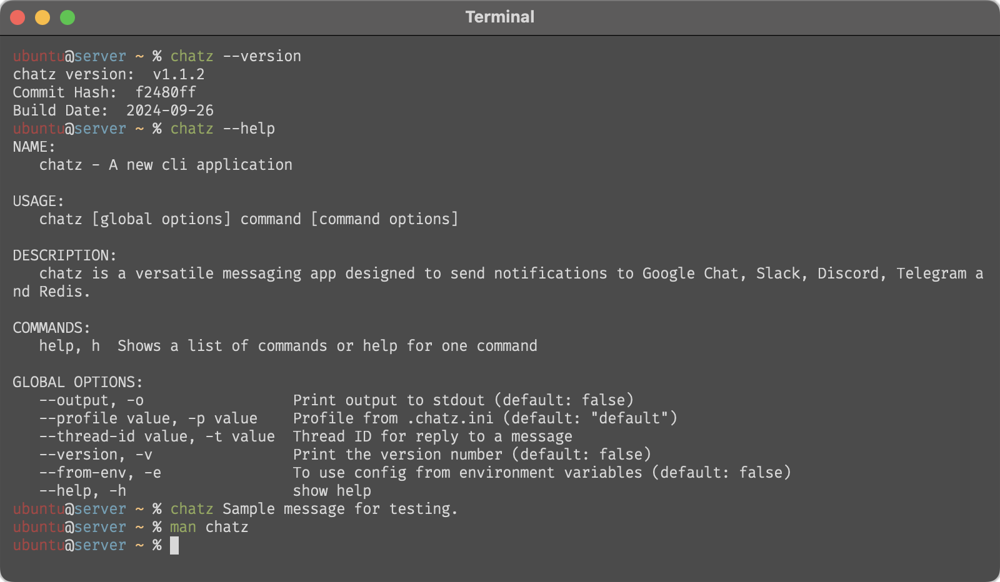

# chatz


<!--  -->
<!--  -->
<!--  -->

*Chatz* is an open-source application designed to send messages to popular communication platforms like Google Chat, Slack, Discord and Telegram etc. Whether you're monitoring server health, tracking job completions, or needing a quick notification tool, Chatz offers a unified way to communicate with your teams and devices, such as:

- Event Notifications: Automatically notify users of events occurring in background jobs, system processes, or application workflows.
- Alerts : Integrate with script to alert teams of system status changes, errors, or other critical updates.

With chatz, you can streamline your notification processes across multiple platforms, making it an essential tool for developers, system administrators, and teams that need reliable communication for automated tasks.



### Supported Providers
- Slack: [Read documentation](docs/slack.md)
- Google Chat: [Read documentation](docs/google.md)
- Telegram: [Read documentation](docs/telegram.md)
- Discord: [Read documentation](docs/discord.md)
- Redis: [Read documentation](docs/redis.md)

## Installation
Download and install executable binary from GitHub releases page.

### Linux Installation
```sh
curl -sL https://github.com/tech-thinker/chatz/releases/download/v1.1.0/chatz-linux-amd64 -o chatz
chmod +x chatz
sudo mv chatz /usr/bin
```

### MacOS Installation
```sh
curl -sL https://github.com/tech-thinker/chatz/releases/download/v1.1.0/chatz-darwin-amd64 -o chatz
chmod +x chatz
sudo mv chatz /usr/bin
```

### Windows Installation
```sh
curl -sL https://github.com/tech-thinker/chatz/releases/download/v1.1.0/chatz-windows-amd64.exe -o chatz.exe
chatz.exe
```

## Setup
- Create config file at home directory. `.chatz.ini`
```ini
[default]
PROVIDER=slack
TOKEN=<token>
CHANNEL_ID=<one-channel-id>

[another]
PROVIDER=slack
TOKEN=<token>
CHANNEL_ID=<another-channel-id>
```

- Config for slack provider
```ini
[default]
PROVIDER=slack
TOKEN=<token>
CHANNEL_ID=<channel-id>
```

- Config for google provider
```ini
[default]
PROVIDER=google
WEB_HOOK_URL=<webhook-url>
```

- Config for telegram provider
```ini
[default]
PROVIDER=telegram
TOKEN=<bot-token>
CHAT_ID=<chat-id>
```

- Config for discord provider
```ini
[default]
PROVIDER=discord
WEB_HOOK_URL=<webhook-url>
```

- Config for redis provider
```ini
[default]
PROVIDER=redis
CONNECTION_URL=<redis-connection-url>
CHANNEL_ID=<redis-publish-channel>
```

## Usage
- Send message using `default` profile
```sh
chatz "hello"
```

- Reply message using `default` profile
```sh
chatz -t="<thread-id>" "Hello"
```

- Send message using `another` profile
```sh
chatz --profile=another "hello"
```

- Reply message using `another` profile
```sh
chatz --profile=another -t="<thread-id>" "Hello"
```

- See output
```sh
chatz -o "Hi"
```

- See help
```sh
chatz --help
```
